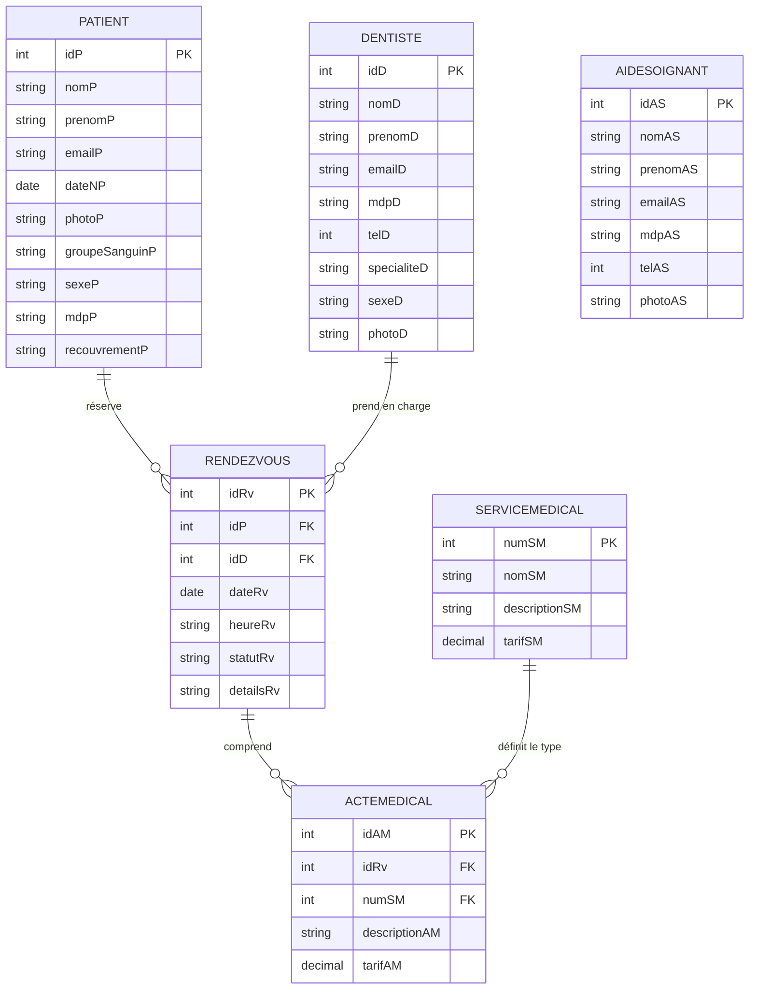

# 🦷 Cabinet Dentaire — Plateforme de Gestion de Rendez-vous en Ligne

<p align="center">
  

</p>

<p align="center">
  <em>« Votre sourire, notre priorité »</em>
</p>

<p align="center">
  
  
  
  
  
  
</p>

---

## 📖 Sommaire

- [Aperçu du Projet](#-aperçu-du-projet)
- [Fonctionnalités Principales](#-fonctionnalités-principales)
  - [Espace Patient](#-espace-patient)
  - [Espace Dentiste](#-espace-dentiste)
  - [Espace Aide-Soignant / Secrétariat](#-espace-aide-soignant--secrétariat)
- [Architecture Technique](#-architecture-technique)
  - [Modèle MVC 3-Tiers](#modèle-mvc-3-tiers)
  - [Modèle de Données (MCD / Entités)](#modèle-de-données-mcd--entités)
- [Stack Technologique](#-stack-technologique)
- [Structure du Projet](#-structure-du-projet)
- [Installation et Configuration](#-installation-et-configuration)
  - [1. Prérequis](#1-prérequis)
  - [2. Base de données MySQL](#2-base-de-données-mysql)
  - [3. Configuration du DataSource dans WildFly](#3-configuration-du-datasource-dans-wildfly)
  - [4. Dépendances JAR](#4-dépendances-jar)
  - [5. Déploiement et Exécution](#5-déploiement-et-exécution)
- [Comptes de Test (Initialisation)](#-comptes-de-test-initialisation)
- [Cartographie des URLs (Servlets)](#-cartographie-des-urls-servlets)
- [Design & Expérience Utilisateur](#-design--expérience-utilisateur)

---

## 🌟 Aperçu du Projet

**Cabinet Dentaire** est une application web d'entreprise conçue selon les normes **Jakarta EE 10 / Java EE**. Elle permet la digitalisation complète de l'activité d'un cabinet dentaire haut de gamme :

- **Prise de rendez-vous intuitive** par les patients selon les disponibilités et les spécialités des praticiens.
- **Gestion des consultations et des actes médicaux** pour le corps soignant.
- **Administration centralisée** des patients, praticiens, services et publications d'actualités médicales.

L'application offre une interface moderne et élégante basée sur une charte graphique épurée (*Luxury Dental Clinic* : nuances nude, rose poudré et typographie soignée).

---

## ⚡ Fonctionnalités Principales

### 👤 Espace Patient
- **Inscription & Profil :** Création de compte complète avec informations médicales (groupe sanguin, couverture sociale, photo de profil).
- **Authentification sécurisée :** Accès à l'espace personnel par email/mot de passe.
- **Catalogue des praticiens :** Consultation des dentistes avec photo, téléphone et spécialité (Orthodontie, Parodontie, Endodontie, etc.).
- **Réservation de Rendez-vous :** Sélection de la date, du créneau horaire, du dentiste souhaité et motif de la consultation.
- **Suivi des rendez-vous :** Consultation de l'historique et de l'état en temps réel (*En attente*, *Confirmé*, *Annulé*, *Terminé*).

### 👨‍⚕️ Espace Dentiste
- **Tableau de bord :** Vue d'ensemble de son planning de rendez-vous.
- **Gestion des statuts :** Validation, modification ou annulation des demandes de rendez-vous.
- **Détails consultations :** Accès aux fiches des patients et aux détails des rendez-vous.
- **Actes médicaux associés :** Consultation des actes et tarifs liés aux consultations.

### 🩺 Espace Aide-Soignant / Secrétariat
- **Gestion des patients :** Enregistrement, modification et suppression des fiches patients.
- **Gestion des praticiens & soignants :** Administration des dentistes et des aides-soignants.
- **Gestion de la nomenclature médicale :**
  - **Services médicaux :** Gestion du catalogue des prestations et tarifs associés.
  - **Actes médicaux :** Enregistrement et suivi des actes effectués durant chaque consultation.
- **Gestion des publications :** Rédaction et diffusion d'articles, conseils de prévention dentaire et actualités avec pièces jointes / images (upload multipart).

---

## 🏗 Architecture Technique

L'application respecte les bonnes pratiques du standard **Jakarta EE** articulé autour du patron de conception **MVC (Modèle - Vue - Contrôleur)** multi-niveaux.

### Modèle MVC 3-Tiers

```
┌─────────────────────────────────────────────────────────────┐
│                    COUCHE PRÉSENTATION                      │
│            JSP (JavaServer Pages) + JSTL + CSS3             │
└──────────────────────────────┬──────────────────────────────┘
                               │ Requêtes HTTP (GET/POST)
                               ▼
┌─────────────────────────────────────────────────────────────┐
│                     COUCHE CONTRÔLEUR                       │
│        Jakarta Servlets (@WebServlet, @MultipartConfig)     │
│         Gestion des sessions & navigation applicative        │
└──────────────────────────────┬──────────────────────────────┘
                               │ Injection EJB (@EJB)
                               ▼
┌─────────────────────────────────────────────────────────────┐
│                       COUCHE MÉTIER                         │
│           EJB Stateless (@Stateless, @Local)                │
│       EJB Singleton d'initialisation (@Singleton @Startup)  │
└──────────────────────────────┬──────────────────────────────┘
                               │ EntityManager (JPA / JTA)
                               ▼
┌─────────────────────────────────────────────────────────────┐
│                    COUCHE PERSISTENCE                       │
│      Jakarta Persistence API (JPA 3.1) / Hibernate ORM      │
│                 Transactions JTA sur WildFly                │
└──────────────────────────────┬──────────────────────────────┘
                               │ JDBC
                               ▼
┌─────────────────────────────────────────────────────────────┐
│                     BASE DE DONNÉES                         │
│                       MySQL 8.0+                            │
└─────────────────────────────────────────────────────────────┘
```

### Modèle de Données (MCD / Entités)



---

## 💻 Stack Technologique

| Composant | Technologie | Version / Détail |
| :--- | :--- | :--- |
| **Langage** | Java | JDK 17+ |
| **Spécification** | Jakarta EE | 10.0 (Servlet 6.0, EJB 4.0, JPA 3.1) |
| **Serveur d'applications** | WildFly (JBoss) | 27.x+ / 30.x+ |
| **ORM & Persistance** | Hibernate / JPA | JTA Transactions, `persistence.xml` |
| **Base de données** | MySQL Server | 8.0+ |
| **Vues / Front-End** | JSP & JSTL | JSTL 3.0 API, Expressions EL |
| **Style & Design** | CSS3 Vanilla & Google Fonts | *Playfair Display* & *Plus Jakarta Sans* |
| **Upload de fichiers** | Jakarta Servlet Multipart | `@MultipartConfig` vers répertoire `/uploads` |

---

## 📁 Structure du Projet

```text
rendezVousDentaire/
├── src/
│   └── main/
│       ├── java/
│       │   ├── entities/               # Entités JPA (Mappage ORM avec annotations)
│       │   │   ├── ActeMedical.java
│       │   │   ├── AideSoignant.java
│       │   │   ├── Dentiste.java
│       │   │   ├── Patient.java
│       │   │   ├── Rendezvous.java
│       │   │   └── ServiceMedical.java
│       │   ├── interfaces/             # Interfaces EJB Locales (@Local)
│       │   │   ├── ActeMedicalLocal.java
│       │   │   ├── AideSoignantLocal.java
│       │   │   ├── DentisteLocal.java
│       │   │   ├── PatientLocal.java
│       │   │   ├── RendezvousLocal.java
│       │   │   └── ServiceMedicalLocal.java
│       │   ├── services/               # EJB Session Beans Stateless & Initializer
│       │   │   ├── ActeMedicalService.java
│       │   │   ├── AideSoignantService.java
│       │   │   ├── DataInitializer.java     # Singleton d'amorçage automatique des données
│       │   │   ├── DentisteService.java
│       │   │   ├── PatientService.java
│       │   │   ├── RendezvousService.java
│       │   │   └── ServiceMedicalService.java
│       │   └── servlets/               # Contrôleurs HTTP Jakarta
│       │       ├── ActeMedicalServlet.java
│       │       ├── AideSoignantServlet.java
│       │       ├── ConnexionServlet.java
│       │       ├── DeconnexionServlet.java
│       │       ├── DentisteServlet.java
│       │       ├── InscriptionPatientServlet.java
│       │       ├── PublicationServlet.java
│       │       ├── RendezvousServlet.java
│       │       └── ServiceMedicalServlet.java
│       └── webapp/
│           ├── css/
│           │   └── mesStyles.css       # Charte graphique & thème luxe
│           ├── uploads/                # Images et fichiers téléversés
│           ├── WEB-INF/
│           │   ├── classes/META-INF/
│           │   │   └── persistence.xml # Configuration de l'Unité de Persistance JPA
│           │   ├── jsp/                # Vues protégées accessibles via servlets
│           │   │   ├── Acceuil.jsp
│           │   │   ├── ActeMedical.jsp
│           │   │   ├── AideSoignant.jsp
│           │   │   ├── connexion.jsp
│           │   │   ├── Dentiste.jsp
│           │   │   ├── DetailDentiste.jsp
│           │   │   ├── DetailRendezvous.jsp
│           │   │   ├── header.jsp
│           │   │   ├── ListeActes.jsp
│           │   │   ├── ListeServices.jsp
│           │   │   ├── Patient.jsp
│           │   │   ├── Publication.jsp
│           │   │   ├── PublicationDetail.jsp
│           │   │   ├── Rendezvous.jsp
│           │   │   └── Service.jsp
│           │   ├── lib/                # Bibliothèques JSTL Jakarta
│           │   │   ├── jakarta.servlet.jsp.jstl-3.0.1.jar
│           │   │   └── jakarta.servlet.jsp.jstl-api-3.0.0.jar
│           │   └── web.xml             # Descripteur de déploiement
│           └── index.jsp               # Page d'accueil publique
├── download_jars.bat                   # Script d'assistance de téléchargement des dépendances
└── .gitignore
```

---

## 🚀 Installation et Configuration

### 1. Prérequis
- **JDK 17 ou supérieur** installé et configuré (`JAVA_HOME`).
- **Serveur WildFly 27+** (supportant Jakarta EE 10).
- **MySQL Server 8.0+** en cours d'exécution.
- Un IDE comme **Eclipse IDE for Enterprise Java**, **IntelliJ IDEA Ultimate** ou **VS Code**.

---

### 2. Base de données MySQL
Créer une nouvelle base de données MySQL :

```sql
CREATE DATABASE IF NOT EXISTS cabinetdentaire 
CHARACTER SET utf8mb4 
COLLATE utf8mb4_unicode_ci;
```

> **Note :** Grâce à la configuration `hibernate.hbm2ddl.auto = update` dans [persistence.xml](file:///c:/Users/Admin/Downloads/RendezvousDentaire-master/RendezvousDentaire-master/jee/rendezVousDentaire/src/main/webapp/WEB-INF/classes/META-INF/persistence.xml), les tables SQL sont automatiquement créées et mises à jour lors du premier déploiement.

---

### 3. Configuration du DataSource dans WildFly
L'application utilise la source de données JNDI : `java:/jdbc/cabinetdentaireDS`.

1. Installer le module pilote JDBC MySQL dans WildFly (`com/mysql`).
2. Ajouter le DataSource dans le fichier `standalone/configuration/standalone.xml` de WildFly :

```xml
<datasource jndi-name="java:/jdbc/cabinetdentaireDS" pool-name="cabinetdentaireDS" enabled="true" use-java-context="true">
    <connection-url>jdbc:mysql://localhost:3306/cabinetdentaire?useSSL=false&amp;serverTimezone=UTC&amp;allowPublicKeyRetrieval=true</connection-url>
    <driver>mysql</driver>
    <security>
        <user-name>root</user-name>
        <password>VOTRE_MOT_DE_PASSE</password>
    </security>
    <validation>
        <valid-connection-checker class-name="org.jboss.jca.adapters.jdbc.extensions.mysql.MySQLValidConnectionChecker"/>
        <validate-on-match>true</validate-on-match>
        <exception-sorter class-name="org.jboss.jca.adapters.jdbc.extensions.mysql.MySQLExceptionSorter"/>
    </validation>
</datasource>
```

*(Ou configurez-le directement via la console d'administration WildFly sur `http://localhost:9990`).*

---

### 4. Dépendances JAR
Les bibliothèques JSTL sont incluses dans `WEB-INF/lib`. Pour les APIs Jakarta EE de compilation (fournies à l'exécution par WildFly), un script d'assistance [download_jars.bat](file:///c:/Users/Admin/Downloads/RendezvousDentaire-master/RendezvousDentaire-master/jee/rendezVousDentaire/download_jars.bat) est fourni à la racine du projet.

---

### 5. Déploiement et Exécution

1. Démarrer le serveur d'application WildFly.
2. Déployer l'application sous forme de fichier `.war` ou en mode déployé (*exploded deployment*) sous le nom contextuel `rendezVousDentaire`.
3. Ouvrir votre navigateur sur :
   ```
   http://localhost:8080/rendezVousDentaire/
   ```

---

## 🔑 Comptes de Test (Initialisation)

L'EJB Singleton `DataInitializer` peuple automatiquement la base de données au démarrage avec des praticiens de test :

| Rôle | Nom & Prénom | Email | Mot de passe | Spécialité |
| :--- | :--- | :--- | :--- | :--- |
| **Dentiste** | Dr. Ahmed Aloui | `ahmed@sourire.tn` | `123456a` | Orthodontiste |
| **Dentiste** | Dr. Sonia Trabelsi | `sonia@sourire.tn` | `123456s` | Parodontiste |
| **Dentiste** | Dr. Wael Elmaghrbi | `wael@sourire.tn` | `123456w` | Endodontiste |

> Les patients et aides-soignants peuvent être créés directement depuis les interfaces d'inscription `/patient` et `/aidesoignant`.

---

## 🗺 Cartographie des URLs (Servlets)

| URL Pattern | Servlet | Méthodes | Description |
| :--- | :--- | :--- | :--- |
| `/` | `index.jsp` | `GET` | Page d'accueil publique du cabinet |
| `/connexion` | `ConnexionServlet` | `GET`, `POST` | Authentification multi-rôles (Patient, Dentiste, Soignant) |
| `/deconnexion` | `DeconnexionServlet` | `GET` | Fermeture de session et redirection |
| `/patient` | `InscriptionPatientServlet` | `GET`, `POST` | Inscription des patients & gestion de profil |
| `/dentiste` | `DentisteServlet` | `GET`, `POST` | Catalogue des dentistes, fiche de profil et administration |
| `/aidesoignant` | `AideSoignantServlet` | `GET`, `POST` | Gestion des soignants et assistance du cabinet |
| `/rendezvous` | `RendezvousServlet` | `GET`, `POST` | Réservation, annulation, validation des statuts de RDV |
| `/service` | `ServiceMedicalServlet` | `GET`, `POST` | Consultation et gestion des prestations dentaires |
| `/acte` | `ActeMedicalServlet` | `GET`, `POST` | Saisie et affectation des actes médicaux réalisés |
| `/publication` | `PublicationServlet` | `GET`, `POST` | Publication d'articles d'actualité et upload de médias |

---

## 🎨 Design & Expérience Utilisateur

L'interface a été conçue pour offrir une expérience calme, soignée et professionnelle :
- **Palette de couleurs harmonieuse :**
  - Fond doux : `#F9F7F2` *(Beige nude)*
  - Typographie & contrastes : `#4A3F35` *(Brun prestige)*
  - Accentuation : `#D4A373` *(Or rose / Terracotta)*
- **Typographie :** Combinaison de **Playfair Display** pour les titres et **Plus Jakarta Sans** pour une lisibilité maximale des données médicales.
- **Glassmorphism & animations :** Cartes translucides, ombres douces et transitions fluides au survol.

---

## 👥 Auteur & Licence

Projet développé dans le cadre des technologies d'entreprise **Java / Jakarta EE**.

- **Licence :** Ce projet est distribué sous licence MIT.
- **Contact & Support :** Pour toute question ou suggestion, vous pouvez ouvrir une *Issue* sur le dépôt GitHub.
